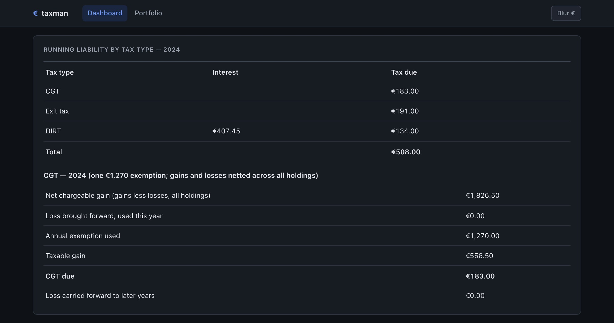
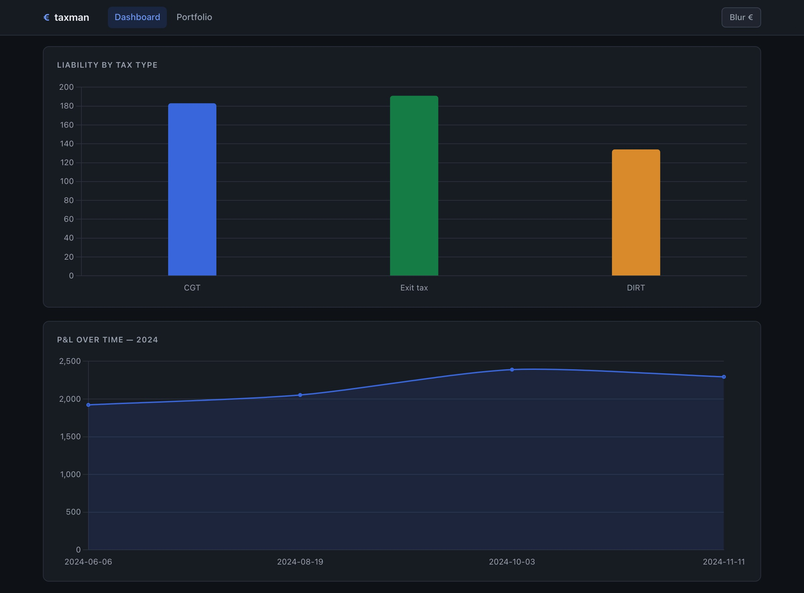
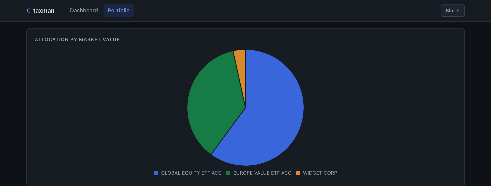
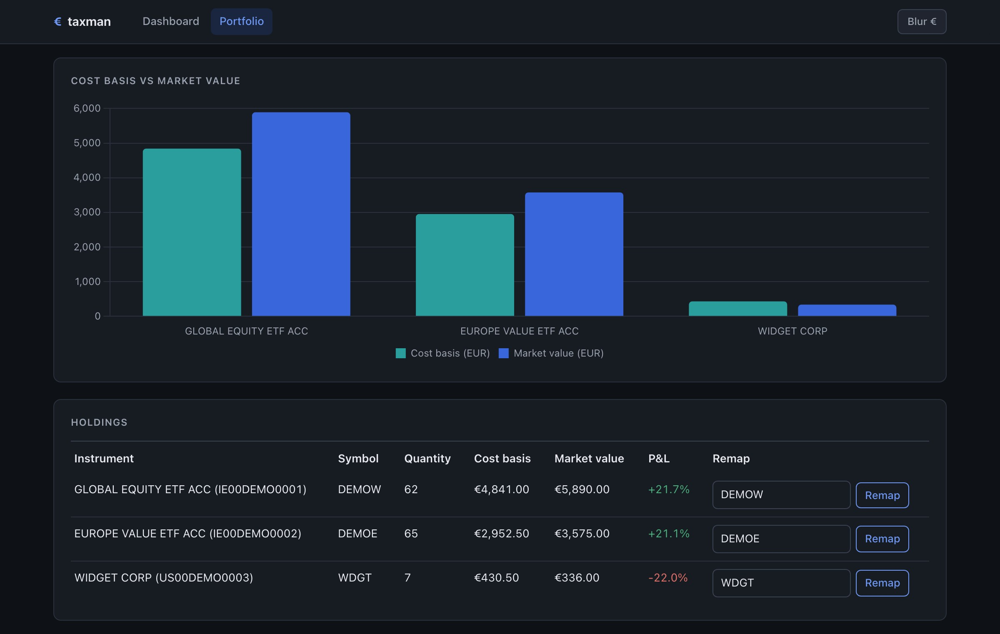

# taxman - Tax Manager for Investments in Ireland

Self-hosted, single-binary tool that ingests broker CSV exports (Degiro,
IBKR, ETRADE) plus hand-entered savings interest, and computes running
Irish CGT, exit-tax and DIRT liability with a full audit trail. See [`SPEC.md`](SPEC.md).

**How the tax is calculated** — every formula in plain English with its
Irish tax-law citation (TCA 1997, Finance Act 2025, Revenue Tax and Duty
Manuals): [`docs/maths.md`](docs/maths.md). Each rule has an executable
worked example in [`features/`](features/) whose figures come from the
engine itself (`make bdd` to run them, `make docs` to render a single
shareable page).

```sh
taxman serve        # local dashboard at http://localhost:8080
taxman import <file>
taxman report --year 2024
```

## Screenshots

Every figure below comes from the fabricated demo dataset in
[`testdata/demo/`](testdata/demo/) — invented instruments, ISINs and
amounts. Run `make demo` to reproduce it locally.

Running Irish CGT / exit-tax / DIRT liability for a tax year, with the
audit-linked CGT breakdown:



The same figures as charts — liability by tax type, and cumulative
realised P&L over the year:



The `/portfolio` view — current market value by holding as an
allocation pie:



…and per holding, live market value against cost basis with a
**P&L %** column:



For screen-sharing your *own* figures there is a **privacy mode**: the
*Blur €* toggle in the nav blurs every money figure (and, on the
portfolio page, the ticker and share-count columns). Charts keep their
shape but drop the value axis. The setting is remembered per browser.
Hover any single figure to reveal just that one.

## Portfolio page

`taxman serve` also exposes `/portfolio` — a live "what is this worth
today" view, separate from the tax dashboard:

- An **allocation pie** of current market value by product, and
  **cost-basis-vs-market-value bars** per product (the gap is your
  unrealised gain/loss). Everything shown in euro.
- Only currently-held positions with a **ticker mapping** are valued.
  Map a market symbol (e.g. `AAPL`, `VWRL.L`) to each holding using the
  form on the page — taxman never guesses a symbol from the instrument
  name or ISIN.
- Prices come from public endpoints (Yahoo Finance, with stooq as a
  fallback) with **no API key**. When they can't be reached the page
  shows the last-known prices with a "prices as of" stamp rather than
  going blank.
- If those endpoints are rate-limited or blocked on your network, set
  `TAXMAN_FINNHUB_TOKEN` (a free [finnhub.io](https://finnhub.io) API
  key) and it will be tried first. Only the ticker symbol and the token
  are sent — never any holdings data. For local dev,
  `cp .env.example .env`, fill it in, and `make dev` loads it
  automatically (`.env` is gitignored).
- Holdings that can't be priced or converted to euro (no mapping, no
  quote, or no FX rate for the quote's currency) are listed separately
  and excluded from the totals and charts.

The portfolio page is always "as of now" and ignores the dashboard's
`?year=` selector. Live quotes are never written to the audit trail and
never feed the tax computation.

## Deploying with Docker

`docker compose up -d --build` builds the single-binary image and runs
`taxman serve` with the SQLite database on a named volume, publishing
the port on the host at `:8088` (e.g. `http://192.168.1.10:8088/`).
It has **no public path** — not on `npm_network`, no reverse proxy, no
hostname — reachable only over the LAN/tailnet, which is deliberate
since there's no login. `make deploy` (`scripts/deploy.sh`) syncs
committed changes to the box and rebuilds in place over SSH. See
[`docs/deploy.md`](docs/deploy.md) for the full walkthrough, DB
seeding, backups, and CLI subcommands.

## Disclaimer

taxman is a personal tool, not tax software and not tax advice. It has
no professional review, no certification, and no guarantee of
correctness — Irish tax law changes and the engine may be wrong or out
of date. Every figure it produces is a starting point for a
conversation with a qualified accountant, never a filing. You are
responsible for what you file. See the warranty disclaimer in
[`LICENSE`](LICENSE).

The design goal is that its arithmetic can be *checked* rather than
trusted: [`docs/maths.md`](docs/maths.md) states every rule with its
citation, and [`features/`](features/) pins a worked example to each
one straight from the engine.

## License

[MIT](LICENSE).
